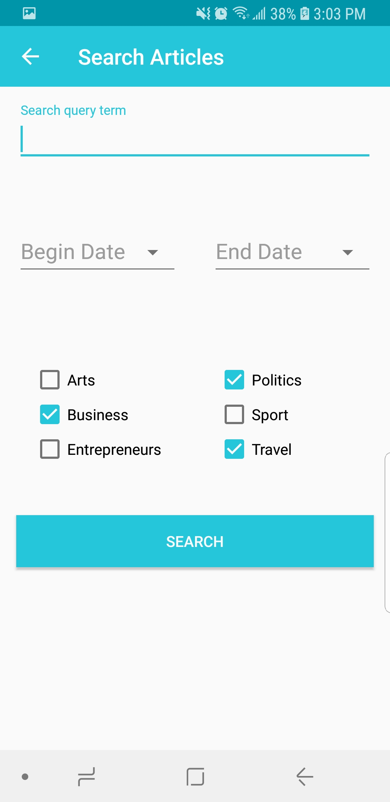
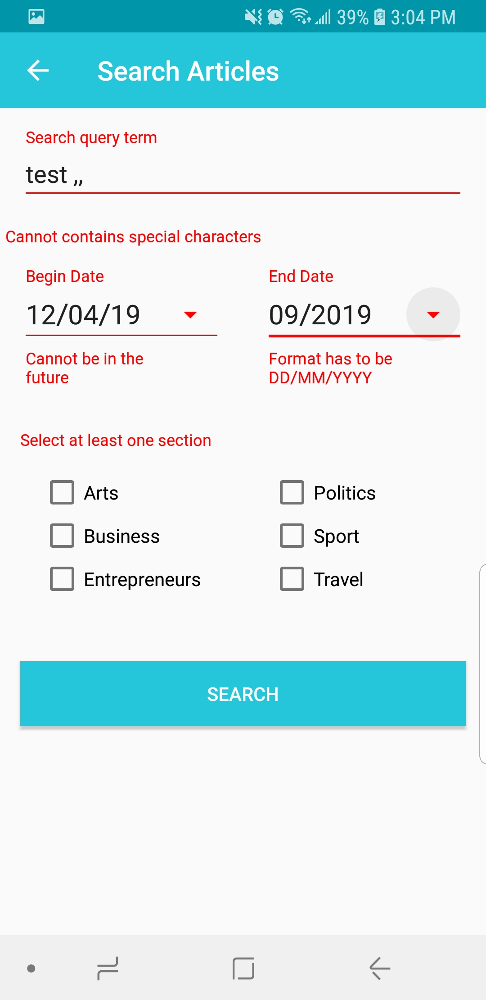
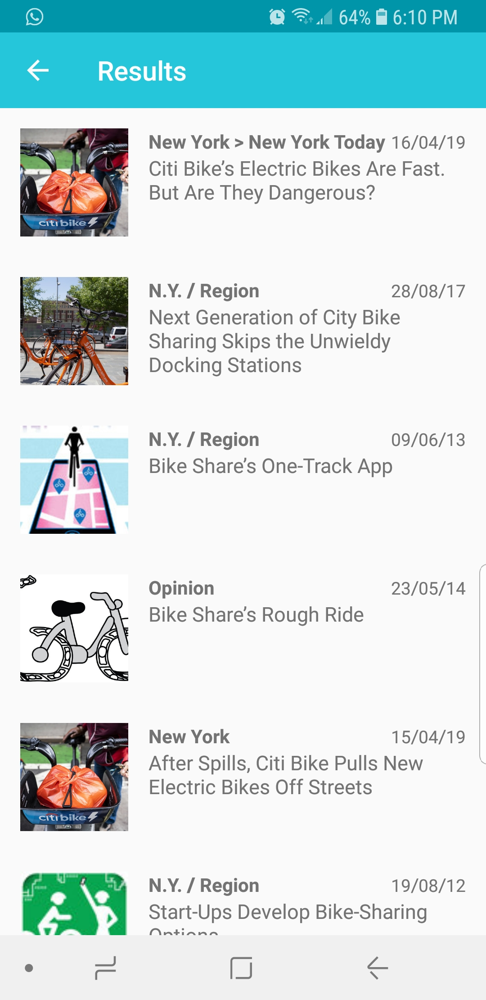
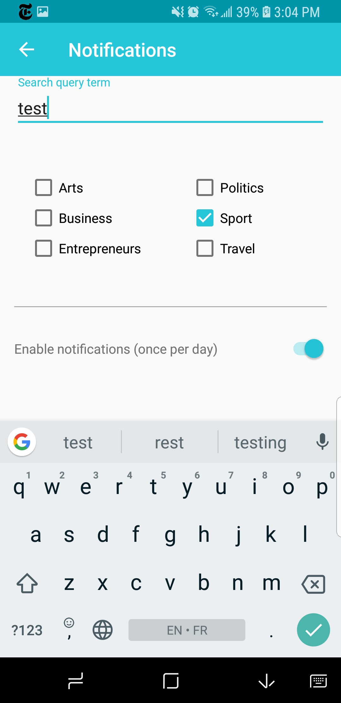
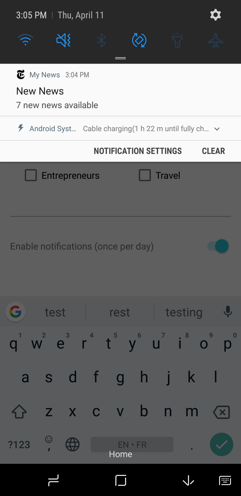

# MyNews
-------------
An Android app to get the latest news from The New York Times.
You can choose between 3 categories:
* Top Stories
* Most Popular (the most shared news)
* Sports (top stories in the sport category)
	

You can also search for news, if the query is wrong the UI will let you know. All the result will be display in a new screen.

&ensp;&ensp;

You can display the details of a new by clicking a it it contents will be display in the application.

You can also activate notifiction for a special query and be notify once a day if new articles have been published

&ensp;

## Library
* [Android Support Library](https://developer.android.com/topic/libraries/support-library/)
* [Glide](https://github.com/bumptech/glide/)
* [Gson](https://github.com/google/gson/)
* [ButterKnife](https://jakewharton.github.io/butterknife/)
* [Retrofit](https://square.github.io/retrofit/)
* [RxJava](https://github.com/ReactiveX/RxJava)
* [SwipeRefreshLayoutBottom](https://bitbucket.org/andreyice/swiperefreshlayoutbottom)
* [Mockito](https://site.mockito.org/)
* [Espresso](https://developer.android.com/training/testing/espresso)
* [Robolectric](http://robolectric.org/)

## API
* [New York Times API]("https://api.nytimes.com)

## Architecture
* MVP
* Java

## Developed By

Galou Minisini

    Copyright 2019 Galou Minisini
